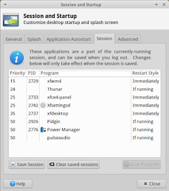
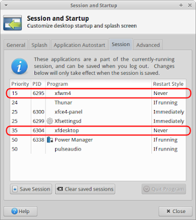
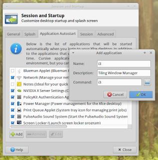
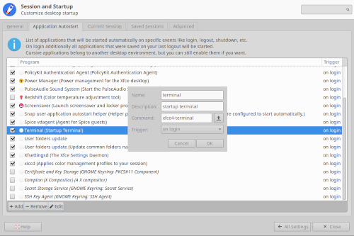
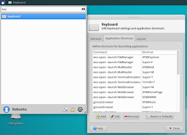

# natkiypie's dotfiles


> We were always alone, never lonely.

## Table of Contents (Steps to Reproduce)

- [Git](https://github.com/natkiypie/dotfiles#git)
- [Github CLI](https://github.com/natkiypie/dotfiles#github-cli)
- [Pass](https://github.com/natkiypie/dotfiles#pass)
- [Node Version Manager](https://github.com/natkiypie/dotfiles#node-version-manager)
- [Npm Global Packages](https://github.com/natkiypie/dotfiles#npm-global-packages)
- [Debian Packages](https://github.com/natkiypie/dotfiles#debian-packages)
- [Optional Packages](https://github.com/natkiypie/dotfiles#optional-packages)
- [Terminal Utilities](https://github.com/natkiypie/dotfiles#terminal-utilities)
  - [Broot](https://github.com/natkiypie/dotfiles#broot)
  - [Delta](https://github.com/natkiypie/dotfiles#delta)
  - [Glow](https://github.com/natkiypie/dotfiles#glow)
  - [Lazygit](https://github.com/natkiypie/dotfiles#lazygit)
  - [StyLua](https://github.com/natkiypie/dotfiles#stylua)
- [Dotfiles](https://github.com/natkiypie/dotfiles#dotfiles)
- [Neovim](https://github.com/natkiypie/dotfiles#neovim)
- [Sumneko Lua Language Server](https://github.com/natkiypie/dotfiles#sumneko-lua-language-server)
- [i3](https://github.com/natkiypie/dotfiles#i3-xubuntu)
- [Other Useful Features & Settings](https://github.com/natkiypie/dotfiles#other-useful-features--settings)

## Git

> Git is a fast, scalable, distributed revision control system with an unusually rich command set that provides both high-level operations and full access to internals.

- https://git-scm.com/
- https://git-scm.com/book/en/v2/Getting-Started-First-Time-Git-Setup

#### Installation & Setup

1. Install git:

```
sudo apt install git
```

2. Set user name and email address:

```
git config --global user.name "Max Demian"; git config --global user.email maxdemian@example.com
```

3. Configure default editor:

```
git config --global core.editor vim
```

4. Set default initial branch:

```
git config --global init.defaultBranch main
```

5. Check settings:

```
git config --list
```

## Github CLI

> GitHub CLI is an open source tool for using GitHub from your computer's command line. When you're working from the command line, you can use the GitHub CLI to save time and avoid switching context.

- https://docs.github.com/en/github-cli/github-cli/quickstart

#### Installation & Setup

1. Install gh:

```
sudo apt install gh
```

2. Authenticate to github

```
gh auth login
```

## Pass

> Lightweight directory-based password manager. Stores, retrieves, generates, and synchronizes passwords securely using gpg and git.

- https://www.passwordstore.org/

#### Installation & Setup

1. Make sure gpg - encryption and signing tool - is installed:

```
sudo apt policy gpg
```

2. If not, install it:

```
sudo apt install gpg
```

3. Install pass:

```
sudo apt install pass
```

4. If a gpg key & password store have already been generated, skip to [this](https://github.com/natkiypie/dotfiles-readme#copy-gpg-private-key-trust-database--password-store-to-trusted-machines) section. Otherwise, generate a new gpg key: https://docs.github.com/en/authentication/managing-commit-signature-verification/generating-a-new-gpg-key

5. List gpg key ID - in this example, the gpg key ID is **3AA5C34371567BD2**:

```
gpg --list-secret-keys --keyid-format=long
```

```
/Users/hubot/.gnupg/secring.gpg
------------------------------------
sec   4096R/3AA5C34371567BD2 2016-03-10 [expires: 2017-03-10]
uid                          Hubot
ssb   4096R/42B317FD4BA89E7A 2016-03-10
```

6. Initialize the password store - here, the password storage key is the gpg key ID from previous step:

```
pass init 3AA5C34371567BD2
```

#### Copy GPG Private Key, Trust Database & Password Store To Trusted Machines

1. Get key ID - in this example, the key ID is **KLVP1DFUW09SK6XB2CDA84BX3AA5C34371567BD2**:

```
gpg --list-keys
```

```
/Users/hubot/.gnupg/pubring.gpg
------------------------------------
pub   4096R 2016-03-10 [expires: 2017-03-10]
      KLVP1DFUW09SK6XB2CDA84BX3AA5C34371567BD2
uid         Hubot
ssb   4096R 2016-03-10
```

2. Export secret key:

```
gpg --export-secret-key KLVP1DFUW09SK6XB2CDA84BX3AA5C34371567BD2 > secret.key
```

3. Export trust database:

```
gpg --export-ownertrust > trust.txt
```

4. Copy password store:

```
cp -r ~/.password-store password-store
```

5. Transport `secret.key` & `password-store` to new machine

6. Rename password store, import trust db & import gpg secret key - you will be prompted to enter the passphrase used when first generating your gpg key:

```
mv password-store .password-store
gpg --import-ownertrust < trust.txt
gpg --import secret.key
```

8. Remove secret key and trust database files

```
rm secret.key trust.txt
```

#### Update Master Password:

1. In the case that a password store was imported and the user password has changed, update the master password:

```
pass edit master/$USER
```

2. If a new password store was created, the user password can be added to the password store using the same method:

```
pass edit master/$USER
```

## Node Version Manager

> Nvm allows you to quickly install and use different versions of node via the command line.

- https://github.com/nvm-sh/nvm

#### Installation & Setup

1. Make sure `curl` is installed:

```
sudo apt policy curl
```

2. If not, install it:

```
sudo apt install curl
```

3. Run latest nvm install script found here: https://github.com/nvm-sh/nvm#install--update-script

```
curl -o- https://raw.githubusercontent.com/nvm-sh/nvm/vx.xx.x/install.sh | bash
```

> Running either of the above commands downloads a script and runs it. The script clones the nvm repository to \~/.nvm, and attempts to add the source lines from the snippet below to the correct profile file (\~/.bash_profile, \~/.zshrc, \~/.profile, or \~/.bashrc).

```bash
export NVM_DIR="$([ -z "${XDG_CONFIG_HOME-}" ] && printf %s "${HOME}/.nvm" || printf %s "${XDG_CONFIG_HOME}/nvm")"
[ -s "$NVM_DIR/nvm.sh" ] && \. "$NVM_DIR/nvm.sh" # This loads nvm
```

4. Refresh the current shell environment:

```
source ~/.bashrc
```

5. Verify install - will output `nvm` on success:

```
command -v nvm
```

6. Download, compile & install latest release of node:

```
nvm install node
```

## Npm Global Packages

> Installing a package globally allows you to use the code in the package as a set of tools on your local computer.

- https://www.npmjs.com/
- https://github.com/npm/cli

#### Installation

1. Install packages globally:

```
npm install -g @fsouza/prettierd commitizen cz-conventional-changelog eslint eslint_d neovim npm-check-updates tree-sitter tree-sitter-cli ts-node typescript typescript-language-server vscode-langservers-extracted
```

<details><summary><b>Package Information</b></summary>
<p>

- `@fsouza/prettierd` - https://www.npmjs.com/package/@fsouza/prettierd
  > Wanna run prettier in your editor, but fast? Welcome to prettierd.
- `commitizen` - https://www.npmjs.com/package/@fsouza/prettierd
  > When you commit with Commitizen, you'll be prompted to fill out any required commit fields at commit time.
- `cz-conventional-changelog` - https://www.npmjs.com/package/cz-conventional-changelog
  > Part of the commitizen family. Prompts for conventional changelog standard.
- `eslint` - https://www.npmjs.com/package/eslint
  > A pluggable JavaScript linter.
- `eslint_d` - https://www.npmjs.com/package/eslint_d
  > Makes eslint the fastest linter on the planet.
- `neovim` - https://www.npmjs.com/package/neovim
  > A neovim node-client.
- `npm-check-updates` - https://www.npmjs.com/package/npm-check-updates
  > npm-check-updates upgrades your package.json dependencies to the latest versions, ignoring specified versions.
- `tree-sitter` • `tree-sitter-cli` - https://www.npmjs.com/package/tree-sitter
  > Incremental parsers for node.
- `ts-node` - https://www.npmjs.com/package/ts-node
  > TypeScript execution and REPL for node.js, with source map and native ESM support.
- `typescript` - https://www.npmjs.com/package/typescript
  > A TypeScript node-client.
- `typescript-language-server` - https://www.npmjs.com/package/typescript-language-server
  > Language Server Protocol implementation for TypeScript wrapping tsserver.
- `vscode-langservers-extracted` - https://www.npmjs.com/package/vscode-langservers-extracted
  > HTML/CSS/JSON language servers extracted from vscode.

</p>
</details>

## Debian Packages

#### Installation

1. Install packages:

```
sudo apt install build-essential compton feh lm-sensors ninja-build stow
```

<details><summary><b>Package Information</b></summary>
<p>

- `build-essential` - required by [nvim-treesitter](https://github.com/nvim-treesitter/nvim-treesitter#requirements)

  > Meta-packages that are necessary for compiling software.

- `compton` - required in [i3 config](/.config/i3/config)

  > A compositor for X11.

- `feh` - required by [set_background_img.sh](/.scripts/initialization/set_background_img.sh)

  > Image viewer and cataloguer.

- `lm-sensors` - required by [run_diagnostics.sh](/.scripts/initialization/run_diagnostics.sh)

  > Show the current readings of all sensor chips.

- `ninja-build` - required by [sumneko lua-language-server](https://github.com/sumneko/lua-language-server/wiki/Build-and-Run)

  > A small build system with a focus on speed.

- `stow` - required in [step 3 of Dotfiles](https://github.com/natkiypie/dotfiles-readme#dotfiles)

  > Manage farms of symbolic links.

</p>
</details>

## Optional Packages

#### Installation

1. Install packages:

```
sudo apt install apt-transport-https devtodo gnome-screenshot htop lightdm-gtk-greeter-settings powertop tlp
```

<details><summary><b>Package Information</b></summary>
<p>

- `apt-transport-https`

  > APT transport for downloading via the HTTP Secure protocol (HTTPS).

- `devtodo`

  > A reminder / task program aimed at developers.

- `gnome-screenshot`

  > Capture the screen, a window, or an user-defined area and save the snapshot image to a file.

- `htop`

  > An interactive process viewer.

- `lightdm-gtk-greeter-settings`

  > Settings editor for LightDM GTK+ Greeter

- `powertop`

  > A power consumption and power management diagnosis tool.

- `tlp`

  > Apply laptop power saving settings

</p>
</details>

## Terminal Utilities

### Broot

> Get an overview of a directory, even a big one.

- https://dystroy.org/broot
- https://github.com/Canop/broot

#### Installation & Setup

1. Download pre-compiled binary `x86-64-linux` found here: https://dystroy.org/broot/install/
2. Change file mode to executable for all users & store in location for non-operating system programs:

```
chmod a+x broot; sudo mv broot /usr/local/bin/
```

3. Refuse shell function install when launching broot for the first time

### Delta

> A syntax-highlighting pager for git, diff, and grep output.

- https://github.com/dandavison/delta
- https://github.com/jesseduffield/lazygit/blob/master/docs/Custom_Pagers.md

#### Installation & Setup

1. Download archive file `git-delta_x.xx.x_arm64.deb` found here: https://github.com/dandavison/delta/releases

2. Install deb file & store in location for non-operating system programs:

```
sudo dpkg -i git-delta_x.xx.x_arm64.deb; mv /usr/bin/delta /usr/local/bin/
```

3. Add delta configuration to `~/.gitconfig` or `~/.config/git/config`:

```gitconfig
[core]
    pager = delta

[interactive]
    diffFilter = delta --color-only

[delta]
    navigate = true

[merge]
    conflictstyle = diff3

[diff]
    colorMoved = default
```

### Glow

> Render markdown on the CLI, with pizzazz!

- https://github.com/charmbracelet/glow

#### Installation & Setup

1. Download archive file `glow_x.x.x_linux_x86_64.tar.gz` & `checksums.txt` found here: https://github.com/charmbracelet/glow/releases

2. Check SHA256 (256-bit) checksums:

```
grep $(sha256sum glow_x.x.x_linux_x86_64.tar.gz) checksums.txt
```

- If checksums match, extract executable from archive, clear additional files & store executable in location for non-operating system programs:

```
tar -zxvf glow_x.x.x_linux_x86_64.tar.gz; rm LICENSE README.md *.tar.gz; sudo mv glow /usr/local/bin/
```

### Lazygit

> A simple terminal UI for git commands, written in Go with the [gocui](https://github.com/jroimartin/gocui) library.

- https://github.com/jesseduffield/lazygit

#### Installation & Setup

1. Download archive file `lazygit_x.xx.x_Linux_x86_64.tar.gz` & `checksums.txt` found here: https://github.com/jesseduffield/lazygit/releases

2. Check SHA256 (256-bit) checksums:

```
grep $(sha256sum lazygit_x.xx.x_Linux_x86_64.tar.gz) checksums.txt
```

- If checksums match, extract executable from archive, clear additional files & store executable in location for non-operating system programs:

```
tar -zxvf lazygit_x.xx.x_Linux_x86_64.tar.gz; rm LICENSE README.md *.tar.gz; sudo mv lazygit /usr/local/bin/
```

### StyLua

> An opinionated code formatter for Lua 5.1, Lua 5.2 and [Luau](https://roblox.github.io/luau/), built using [full-moon](https://github.com/Kampfkarren/full-moon). StyLua is inspired by the likes of [prettier](https://github.com/prettier/prettier), it parses your Lua codebase, and prints it back out from scratch, enforcing a consistent code style.

- https://github.com/johnnyMorganz/StyLua
- https://github.com/jose-elias-alvarez/null-ls.nvim/blob/main/doc/BUILTINS.md#stylua

#### Installation & Setup

1. Download zip file `stylua-x.xx.x-linux.zip` found here: https://github.com/johnnyMorganz/StyLua/releases

2. Unzip compressed files, clear additional files, change file mode to executable for all users & store in location for non-operating system programs:

```
unzip stylua-x.xx.x-linux.zip; rm *.zip; chmod a+x stylua; sudo mv stylua /usr/local/bin/
```

## Dotfiles

> User-specific application configuration is traditionally stored in so called dotfiles (files whose filename starts with a dot).

- https://github.com/natkiypie/dotfiles
- https://alexpearce.me/2016/02/managing-dotfiles-with-stow/

#### Installation & Setup

1. Clone repository:

```
git clone https://github.com/natkiypie/dotfiles.git
```

2. Remove conflicting files:

```
rm -rf $HOME/.bashrc $HOME/.bash_aliases $HOME/.config/broot
```

3. Mirror user's home directory structure & create symbolic links from dotfiles:

```
mv dotfiles $USER; mkdir $HOME/.dotfiles; mv $USER $HOME/.dotfiles; cd $HOME/.dotfiles; stow $USER
```

## Neovim

> Hyperextensible Vim-based text editor.

- https://neovim.io/
- https://github.com/neovim/neovim
- https://launchpad.net/~neovim-ppa/+archive/ubuntu/unstable
- https://thomasventurini.com/articles/install-neovim-05-in-ubuntu

#### Installation & Setup

1. Install vim & neovim nightly

```
sudo add-apt-repository ppa:neovim-ppa/unstable; sudo apt update; sudo apt install vim neovim
```

2. Set default editor

```
sudo update-alternatives --config editor
```

```
  Selection    Path                Priority   Status
------------------------------------------------------------
  0            /bin/nano            40        auto mode
  1            /bin/ed             -100       manual mode
  2            /bin/nano            40        manual mode
* 3            /usr/bin/vim.basic   30        manual mode
  4            /usr/bin/vim.tiny    15        manual mode

Press <enter> to keep the current choice[*], or type selection number: 3
```

3. Add nvim as vim alternative

```
sudo update-alternatives --install $(which vim) vim $(which nvim) 10
```

4. Set nvim as alternative to vim

```
sudo update-alternatives --config vim
```

```
  Selection    Path                Priority   Status
------------------------------------------------------------
  0            /usr/bin/vim.basic   30        auto mode
* 1            /usr/bin/nvim        10        manual mode
  2            /usr/bin/vim.basic   30        manual mode

Press <enter> to keep the current choice[*], or type selection number: 1

```

#### Running Nvim For The First Time

1. Check health:

```
:checkhealth
```

2. Install language servers:

```
:LspInstall tsserver cssls html
```

## Sumneko Lua Language Server

> [Sumneko lua-language-server](https://github.com/sumneko/lua-language-server) is currently the only full-featured [Lua](https://www.lua.org/) language server available. However, the project's development is becoming increasingly focused on optimization for a single client, [VSCode](https://code.visualstudio.com/). Consequently, its compatibility with other clients, such as [Neovim's built-in language server client](https://neovim.io/doc/user/lsp.html), becomes [increasingly diminished](https://github.com/microsoft/vscode/issues/115872). We need to adjust the installation process accordingly.

- https://github.com/sumneko/lua-language-server/wiki/Build-and-Run
- https://github.com/natkiypie/dotfiles/commit/caef6de3150356e07958678f3b1df767a9171f92

#### Installation & Setup

1. Make language servers directory:

```
mkdir $NVIM_CONFIG/language-servers
```

2. Clone sumneko lua-language-server and revert to compatible state:

```
cd $NVIM_CONFIG/language-servers; git clone -n https://github.com/sumneko/lua-language-server.git; cd lua-language-server; git checkout -b main 9f236d0485ac4cee2b62261b84ef93f473596495; git branch -d master
```

3. Update submodules:

```
git submodule update --init --recursive
```

4. Compile:

```
cd 3rd/luamake; ./compile/install.sh
```

5. Build:

```
cd ../..; ./3rd/luamake/luamake rebuild
```

## i3 (Xubuntu)

> i3 is a tiling window manager, completely written from scratch. The target platforms are GNU/Linux and BSD operating systems, our code is Free and Open Source Software (FOSS) under the BSD license.

- https://i3wm.org/
- https://feeblenerd.blogspot.com/2015/11/pretty-i3-with-xfce.html
- https://github.com/Airblader/i3/wiki/installation#ubuntu

#### Installation & Setup

1. Install i3 & i3-gaps:

```
sudo add-apt-repository ppa:regolith-linux/release; sudo apt update; sudo apt install i3 i3-gaps
```

2. Open `Session and Startup`, and go to the `Session` tab:

<p align="center">
  
</p>

3. Change `xfwm4` & `xfdesktop` settings from `Immediately` to `Never` and save session by clicking `Save Session`:

<p align="center">
  
</p>

4. Add i3 to startup applications by going to `Application Autostart` tab:

<p align="center">
  
</p>

5. Add `xfce4-terminal` to startup applications by going to `Application Autostart` tab:

<p align="center">
  
</p>

6. Open `Keyboard` dialogue, go to `Application Shortcuts` tab & remove keyboard shortcuts:

<p align="center">
  
</p>

7. Restart computer for changes to take effect

```
reboot
```

## Other Useful Features & Settings

#### Increase Cursor Speed (Keyboard Settings)

1. Set repeat delay: `250`

2. Set repeat speed: `65`

#### Increase Key Speed (Terminal)

1. Check autorepeat rate:

```
xset -q | grep delay | grep repeat
```

2. Set autorepeat rate

```
xset r rate 250 66
```

#### Install Nerd Fonts

1. Go here: https://github.com/ryanoasis/nerd-fonts/tree/master/patched-fonts

2. Choose your font, download & install into `~/.local/share/fonts`

## TODO

- [ ] Replace images in section: [i3 (Xubuntu)](https://github.com/natkiypie/dotfiles#i3-xubuntu)
- [ ] Write README.md for [nvim](/.config/nvim)

##

<p align="center">
  <a href="https://github.com/natkiypie/dotfiles-readme#natkiypies-dotfiles">Back to Top</a>
</p>
